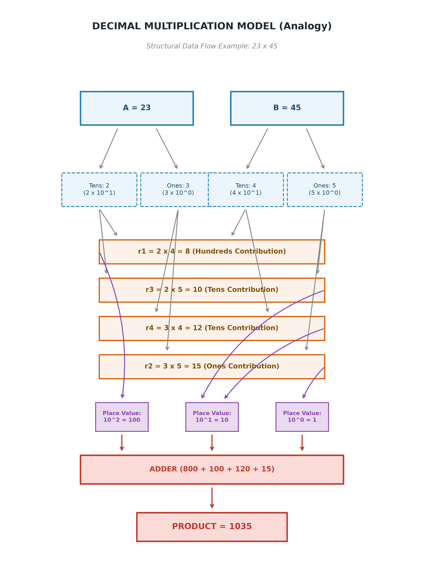
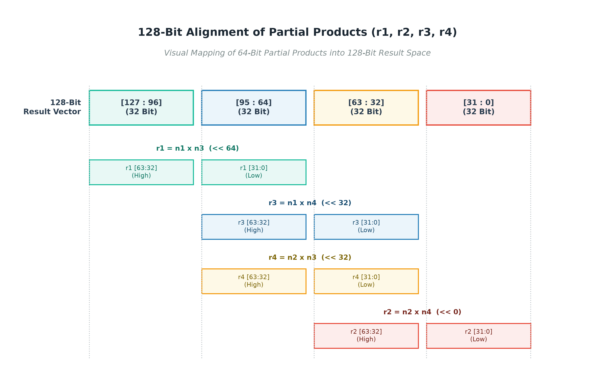
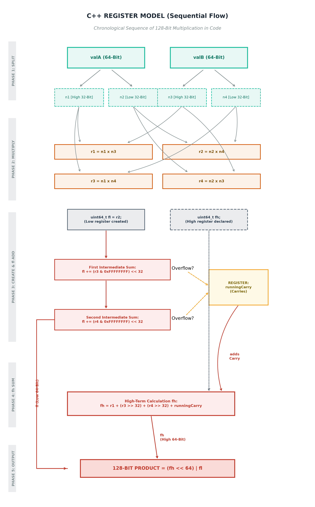
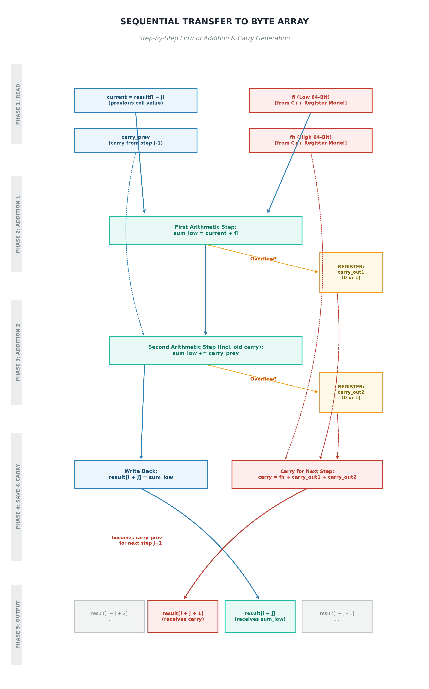

# Multiplication Algorithm

This document outlines the sequential multiplication logic implemented in the `Base256` class.

---

### 1. Decimal Analogy
The multiplication process starts with a standard positional approach. Using a decimal analogy (e.g., $23 \times 45$), the operands are broken down into their positional parts (tens and ones), cross-multiplied, scaled by their place value, and summed to produce the final product.

---

### 2. 128-Bit Alignment Layout
In the binary domain, multiplying two 64-bit inputs (each split into 32-bit halves) results in four 64-bit partial products ($r1$, $r2$, $r3$, $r4$). This layout diagram illustrates how these partial products are shifted and placed within the target 128-bit result space.

---

### 3. C++ Register Model
The sequential C++ register model processes these partial products to form a 128-bit product. It splits the calculation into a lower 64-bit register (`fl`) and a higher 64-bit register (`fh`), sequentially accumulating the terms and tracking any intermediate overflows using a running carry.

---

### 4. Result Vector Integration
Finally, the calculated 128-bit product (`fl` and `fh`) is integrated back into the target array elements (`result`). This step handles addition with existing cell values, tracks two potential overflows, and generates a carry-over value to propagate into the subsequent step.

